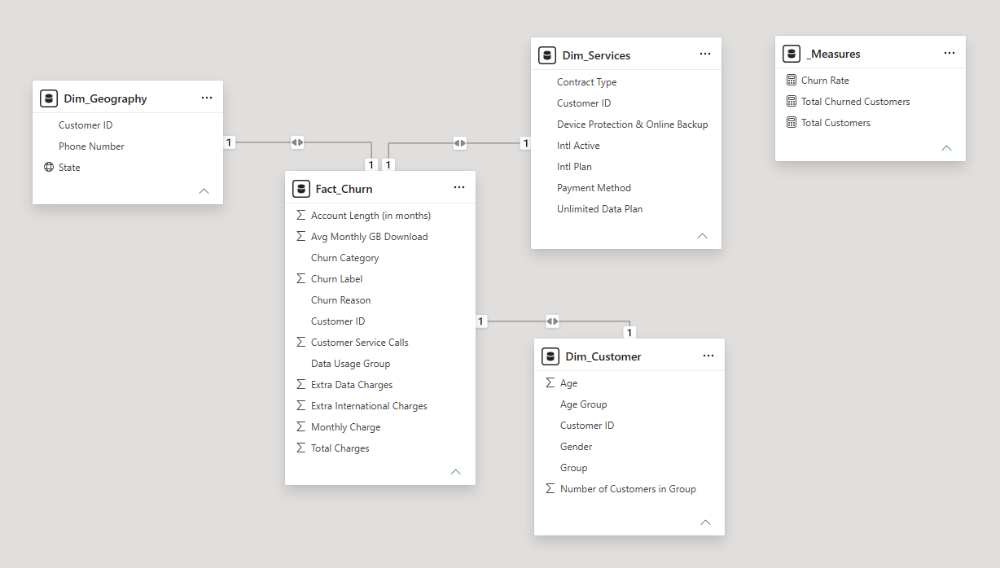
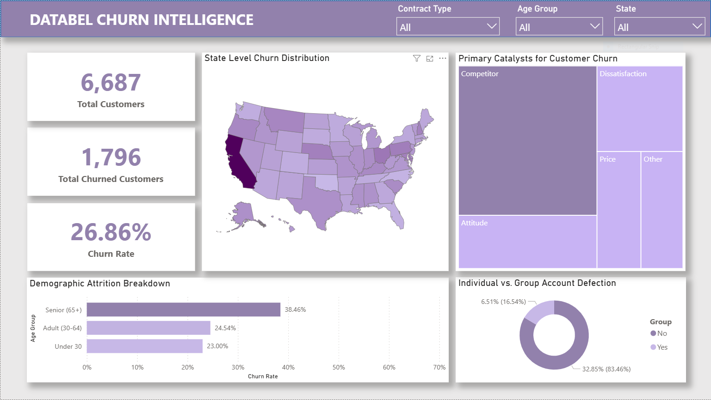
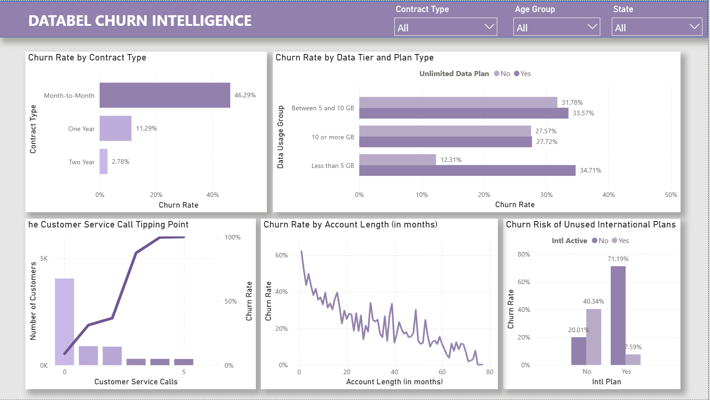

# 📊 Databel Churn Intelligence: Root Cause Analysis & Retention Strategy

## 📌 Executive Summary
This project presents an end-to-end Business Intelligence solution designed to analyze, quantify, and mitigate customer churn for a fictional telecommunications provider (Databel). Starting with a pristine, flat-file foundational dataset, this project focused entirely on structural data modeling and visual analytics to move beyond basic reporting and deliver highly actionable, strategic business insights.

Utilizing Power BI Desktop, the static CSV was structurally engineered into an optimized Star Schema. This foundational data modeling enabled the creation of dynamic, cross-filtering dashboards that isolated the precise operational triggers causing customer defection, ranging from geographical hotspots and competitor vulnerability to the exact volume of customer service calls that trigger an account cancellation. The ultimate goal of this pipeline is to empower leadership to transition from reactive reporting to proactive retention.

---

## 🎯 Core Business Questions
To transition Databel from reactive reporting to proactive retention, this analytical model was designed to answer four strategic business questions:

| Question ID | Strategic Theme | Business Question |
| --- | --- | --- |
| Q1 | Demographic and Geographic Baseline | How does customer attrition vary across different age cohorts and account structures (individual vs. group plans), and which specific geographic states are experiencing the highest intensity of churn? |
| Q2 | Root Cause Taxonomy | What are the primary, categorized catalysts driving customers away, and what is the proportional distribution of these root causes (for example: Competitor vs. Attitude or Price) driving the highest volume of account cancellations? |
| Q3 | Feature Utilization and Service Misalignment | How do specific product misalignments influence defection? Specifically, what is the exact churn rate discrepancy between customers who pay for an International Plan but do not actively use it, and how does the volume of lost accounts distribute across different data consumption tiers? |
| Q4 | Frustration Threshold and Loyalty Drivers | What are the behavioral tipping points for defection? How much retention impact do term contracts (1-Year and 2-Year) provide over month-to-month agreements, and at what exact volume of customer support calls does a customer's risk of churning critically spike? |

---

## 🛠️ Methodology & Data Architecture

### Phase 1: Data Modeling and Star Schema Construction 🗂️
The project began with a pre-processed flat CSV file containing customer attributes, service details, and churn status. To move beyond spreadsheet-level analysis, the dataset was modeled into a strict Star Schema.

| Model Element | Purpose | Key Fields / Content |
| --- | --- | --- |
| Fact_Churn | Quantitative core of the model | Numeric keys, billing amounts, support call counts, churn flag |
| Dim_Customer | Customer demographic context | Age group, gender, group membership |
| Dim_Geography | Geographic context | State |
| Dim_Services | Service and account context | Contract type, International Plan, Unlimited Data Plan, data tiers |

The normalization of the flat file into a fact table and supporting dimensions reduced model complexity, improved Power BI performance, and enabled reliable cross-filtering without DAX ambiguity.

For a detailed dive into each column, see the [data dictionary](data/data-dictionary.md).

### Phase 2: DAX Engineering and Metric Standardization 🧮
A dedicated _Measures table was created to centralize all reusable DAX calculations.

| Standard Measure | Definition Purpose |
| --- | --- |
| Total Customers | Counts the active customer base across all visuals |
| Total Churned | Counts customers marked as churned |
| Churn Rate % | Standardized churn ratio used consistently across reports |

Centralizing measures ensured consistent calculations across all visuals and prevented repeated recalculation logic across the dashboard.

### Phase 3: Dashboard Architecture 📊
The semantic reporting layer was organized into two synchronized canvases, supported by a global slicer bar for Demographic, State, and Contract Type filtering.

| Canvas | Focus | Core Visuals |
| --- | --- | --- |
| Executive Summary | Executive-level performance overview | High-level KPIs, geospatial attrition heatmap, root cause treemap with drill-down |
| Usage and Drivers Deep Dive | Behavioral and operational churn drivers | Contract-length risk analysis, data usage friction, customer service call patterns |

This structure separates strategic overview from diagnostic analysis while preserving a consistent filter experience across both views.

## 🏆 Key Results & Strategic Insights

| RQ | Research Question | Key Result | Strategic Insight |
| --- | --- | --- | --- |
| RQ1 | Group Plan Retention | Individual plans churn at 32.89%, versus 7.98% for group plans. | Incentivize multi-line and family account adoption to improve retention. |
| RQ1 | Geospatial Vulnerability | California is the highest-risk churn hotspot, followed by Texas and New York. | Investigate localized coverage, pricing, or competitor pressure in these states. |
| RQ2 | Competitor Defection Crisis | Competitor-driven churn is the dominant root cause, led by "Competitor made better offer" and "Competitor had better devices." | Databel is losing share on pricing and hardware parity; the product and pricing strategy need immediate review. |
| RQ2 | Attitude Defection Driver | "Attitude of support person" is a major secondary churn reason. | Improve support training and de-escalation practices to reduce avoidable churn. |
| RQ3 | Unused International Plans | Customers paying for an International Plan but not using it show a 71.19% churn rate. | Stop upselling international features to non-travelers and rework the offer logic. |
| RQ3 | Unlimited Data Underutilization | The highest volume of churned customers on Unlimited Data Plan fall into the lowest usage tier. | Customers are overpaying for unused capacity; reposition or simplify the plan structure. |
| RQ4 | Customer Service Tipping Point | Churn rises sharply after the third support call, reaching 87.5% at 3 calls and 100% at 4+ calls. | Trigger an automated retention intervention by the second support ticket. |
| RQ4 | Contract Stability | Month-to-month customers churn at 46.29%, compared with roughly 11% for 1-Year and under 3% for 2-Year contracts. | Long-term contracts materially improve retention and should be actively promoted. |

---

## 🖥️ Dashboard Architecture & Previews
The final semantic reporting layer was divided into two synchronized canvases, utilizing a global Slicer Bar (Demographic, State, Contract Type) to allow for seamless executive exploration.

---

